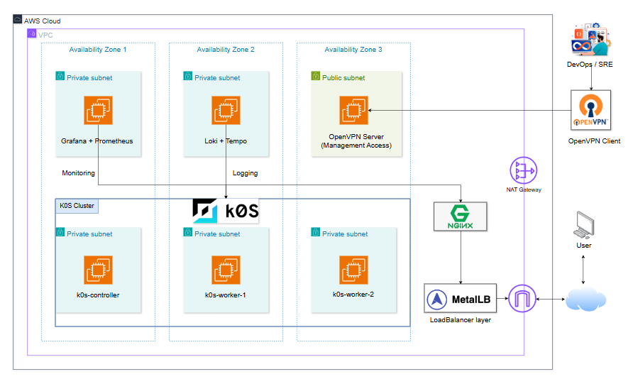

# Cloud-Native Infrastructure for Kubernetes

This repository contains the **Infrastructure as Code (IaC)** implementation
for deploying a **k0s Kubernetes cluster on AWS**, focusing on a
**staging environment** designed according to cloud-native and DevOps best practices.

The infrastructure provisioning is handled using **Terraform**, while
**Ansible** is used for system configuration and observability deployment.

---

## 1. Overview

The objective of this project is to design and deploy a **cloud-native infrastructure** capable of running a k0s-based Kubernetes cluster in a manner
that closely resembles real-world production environments.

Key design principles include:

- Modular and reusable infrastructure design
- Clear separation between infrastructure provisioning and configuration management
- Secure and Kubernetes-ready network architecture
- Automated generation of Ansible inventories from Terraform outputs
- Observability-first approach for monitoring and logging

## 2. Infrastructure Deployment and Configuration

The infrastructure is deployed using Terraform with a **module-based architecture**.
Each module is responsible for a specific layer of the infrastructure, including
networking, security, and compute resources.

Terraform is also responsible for generating dynamic Ansible inventory files,
which enables seamless integration between infrastructure provisioning and
system configuration.

---

### 2.1 Staging Environment

The **staging environment** serves as a controlled platform for deploying,
testing, and validating a k0s Kubernetes cluster before any future
production-oriented extensions.



#### Staging Environment Characteristics

- Deployment across multiple Availability Zones to simulate real-world conditions
- A dedicated VPC with isolated private and public subnets
- k0s Kubernetes cluster consisting of:
  - One controller node
  - Multiple worker nodes
- Dedicated observability nodes running outside the Kubernetes cluster
- Secure management access via an OpenVPN server
- Outbound internet access for private instances through a NAT Gateway
- Load balancing capabilities for Kubernetes services using MetalLB and NGINX

Terraform automatically generates Ansible inventory files and places them under:

```
ansible/inventories/staging/
```

This approach ensures infrastructure consistency and eliminates the need for
hardcoded IP addresses during configuration.

#### Infrastructure Configuration

As part of the staging environment setup, secure access to private
infrastructure components is established before deploying Kubernetes
and observability services.

##### 1️⃣ OpenVPN Deployment (Private Subnet Access)

An OpenVPN server is provisioned to provide secure administrative access
to EC2 instances located in private subnets. This approach avoids direct
public exposure of internal nodes and closely follows real-world
production security practices.

The OpenVPN server is configured and managed using Ansible.

**Connectivity test:**

```bash
ansible -i inventories/staging/openvpn.ini openvpn -m ping
```

If the connectivity test is successful, the OpenVPN server is deployed using:

```
ansible-playbook -i inventories/staging/openvpn.ini playbooks/openvpn_setup.yml
```

After the deployment completes, the OpenVPN client configuration file
is automatically generated and fetched to the local management machine.

Copy the client configuration file to the OpenVPN client directory:

```
cp vpn/devops.ovpn /mnt/c/Users/<username>/OpenVPN/config/
```

Example (Windows user):

```
cp vpn/devops.ovpn /mnt/c/Users/phat4/OpenVPN/config/
```

Once the VPN connection is established, administrators can securely
access EC2 instances in private subnets via SSH:

```
ssh -i key_pair/k0s_key ubuntu@10.0.1.167
```


This VPN-based access model ensures that all Kubernetes nodes and observability components remain isolated from direct internet access while still being fully manageable for deployment and testing purposes.

---

## Author

This project is developed as part of a **cloud-native infrastructure and DevOps study**,
with an emphasis on Kubernetes deployment, observability, and staging environment design.
